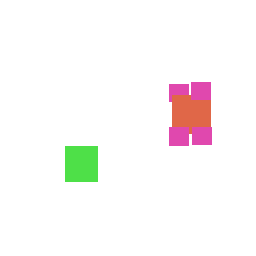
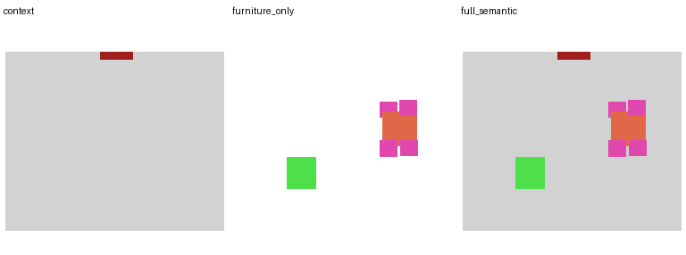
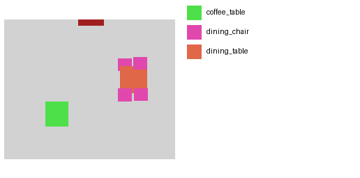

# Training Record After Fix

- sample_id: `36c96aa6-a318-4212-aecc-22a206d7b217_room_00`

## Original bad relation

- `coffee_table near dining_table` existed in the earlier Goal State / prompt and was not supported by target geometry.

## Fix action

- dropped from prompt because target geometry edge_gap_m=`2.3576117680012874`, center_distance_m=`3.7646782508203804`.

## Fixed prompt

Context_Control. Place 1 coffee_table, 4 dining_chair, and 1 dining_table in the livingroom. Keep dining_chair near dining_table. Keep all furniture inside the room, avoid overlap, and do not block doors or windows.

Architecture_Control. Follow the architecture condition image for room boundary, walls, doors, windows, clearance regions, and non-placeable regions.

Palette_Control. Generate a fixed-palette semantic layout only. Use the frozen category-to-color semantic palette. Draw each active furniture category with its assigned palette color only. Do not generate realistic texture, material, lighting, shadow, gradient, anti-aliasing, or unknown colors. Active semantic categories: coffee_table, dining_chair, dining_table.

## Images









## Goal State
```json
{
  "schema_version": "goal-lostate-rich-v1",
  "state_role": "goal",
  "sample_id": "36c96aa6-a318-4212-aecc-22a206d7b217_room_00",
  "room_type": "livingroom",
  "furniture_slots": [
    {
      "slot_id": "slot_coffee_table",
      "category": "coffee_table",
      "required": true,
      "count": 1
    },
    {
      "slot_id": "slot_dining_chair",
      "category": "dining_chair",
      "required": true,
      "count": 4
    },
    {
      "slot_id": "slot_dining_table",
      "category": "dining_table",
      "required": true,
      "count": 1
    }
  ],
  "required_counts": {
    "coffee_table": 1,
    "dining_chair": 4,
    "dining_table": 1
  },
  "pairwise_constraints": [
    {
      "subject": "dining_chair",
      "predicate": "near",
      "object": "dining_table",
      "source": "geometry_verified",
      "geometry_validation": {
        "status": "pass",
        "reason": null,
        "evidence": {
          "subject_instance_id": "furniture/102",
          "object_instance_id": "furniture/103",
          "edge_gap_m": 0.0,
          "center_distance_m": 0.766599385402832,
          "edge_gap_threshold_m": 0.6,
          "center_threshold_m": 1.5
        }
      },
      "validation_source": "layout_json",
      "prompt_allowed": true
    }
  ],
  "global_constraints": [
    "inside_room",
    "avoid_overlap",
    "palette_exact",
    "use_architecture_condition_image",
    "door_clearance_free"
  ],
  "architecture_condition_ref": "meta/36c96aa6-a318-4212-aecc-22a206d7b217_room_00_architecture.json",
  "dropped_pairwise_constraints": [
    {
      "subject": "coffee_table",
      "predicate": "near",
      "object": "dining_table",
      "source": "rule",
      "geometry_validation": {
        "status": "invalid",
        "reason": "target_geometry_not_near",
        "evidence": {
          "subject_instance_id": "furniture/108",
          "object_instance_id": "furniture/103",
          "edge_gap_m": 2.3576117680012874,
          "center_distance_m": 3.7646782508203804,
          "edge_gap_threshold_m": 0.8,
          "center_threshold_m": 1.5
        }
      },
      "validation_source": "layout_json",
      "prompt_allowed": false,
      "reason": "target_geometry_not_near"
    }
  ],
  "dropped_required_counts": [],
  "relation_validation_source": "layout_json"
}
```

## Relation alignment
```json
{
  "sample_id": "36c96aa6-a318-4212-aecc-22a206d7b217_room_00",
  "geometry_verified": [
    {
      "subject": "dining_chair",
      "predicate": "near",
      "object": "dining_table",
      "source": "geometry_verified",
      "geometry_validation": {
        "status": "pass",
        "reason": null,
        "evidence": {
          "subject_instance_id": "furniture/102",
          "object_instance_id": "furniture/103",
          "edge_gap_m": 0.0,
          "center_distance_m": 0.766599385402832,
          "edge_gap_threshold_m": 0.6,
          "center_threshold_m": 1.5
        }
      },
      "validation_source": "layout_json",
      "prompt_allowed": true
    }
  ],
  "dropped": [
    {
      "subject": "coffee_table",
      "predicate": "near",
      "object": "dining_table",
      "source": "rule",
      "geometry_validation": {
        "status": "invalid",
        "reason": "target_geometry_not_near",
        "evidence": {
          "subject_instance_id": "furniture/108",
          "object_instance_id": "furniture/103",
          "edge_gap_m": 2.3576117680012874,
          "center_distance_m": 3.7646782508203804,
          "edge_gap_threshold_m": 0.8,
          "center_threshold_m": 1.5
        }
      },
      "validation_source": "layout_json",
      "prompt_allowed": false,
      "reason": "target_geometry_not_near"
    }
  ],
  "validation_source": "layout_json",
  "full_semantic_report": {
    "output_path": "data/loreflection_qwen_arch_control_p1_small_metric_v2_full_semantic_compiled/target_full_semantic/36c96aa6-a318-4212-aecc-22a206d7b217_room_00_target_full_semantic.png",
    "image_size": [
      256,
      256
    ],
    "palette_exact": true,
    "unknown_colors": [],
    "target_contains_architecture_categories": [
      "door",
      "floor",
      "void"
    ],
    "target_contains_furniture_categories": [
      "coffee_table",
      "dining_chair",
      "dining_table"
    ],
    "furniture_pixel_count": 3698,
    "protected_architecture_overwrite_pixels": 0,
    "forbidden_architecture_overwrite_rate": 0.0
  }
}
```
