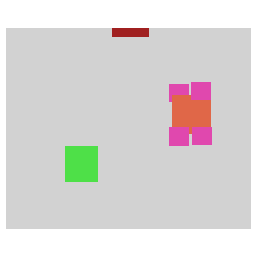
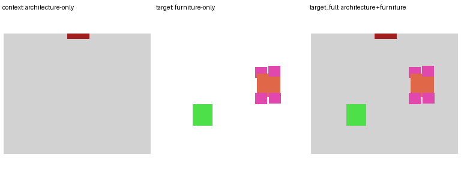

# Full Semantic Qwen Training Record Review

- sample_id: `36c96aa6-a318-4212-aecc-22a206d7b217_room_00`
- room_type: `unknown`
- metadata_source: `/wuqingyaoa800/qiuziyan/LoReflection_arch_p0/data/loreflection_qwen_arch_control_p1_small_metric_v2_prompt_labels_llm/metadata_llm_functional.csv`
- context_image: architecture-only semantic condition.
- target_furniture_only: current LoReflection furniture-layer supervision.
- target_full_semantic: proposed architecture + furniture supervision.
- Qwen full-semantic metadata `image` should point to `target_full_semantic.png`.







## Prompt

Context_Control. Position 1 coffee table close to the dining table and place 4 dining chairs around the dining table. Make sure there is no overlap and that all items are within the room. Use the architectural details to guide the placement while ensuring there is enough space near the door.

## Compiled Prompt

Context_Control. Position 1 coffee table close to the dining table and place 4 dining chairs around the dining table. Make sure there is no overlap and that all items are within the room. Use the architectural details to guide the placement while ensuring there is enough space near the door.

## Goal LoState Summary

- required_counts: `{"coffee_table": 1, "dining_chair": 4, "dining_table": 1}`
- pairwise_constraints: `[{"subject": "dining_chair", "predicate": "near", "object": "dining_table", "source": "rule"}, {"subject": "coffee_table", "predicate": "near", "object": "dining_table", "source": "rule"}]`
- global_constraints: `["inside_room", "avoid_overlap", "palette_exact", "use_architecture_condition_image", "door_clearance_free"]`

## Palette Entries

```json
{
  "coffee_table": [
    78,
    224,
    72
  ],
  "dining_chair": [
    224,
    72,
    174
  ],
  "dining_table": [
    224,
    103,
    72
  ]
}
```

## Metric Transform

```json
{
  "schema_version": "metric-transform-v1",
  "scale_policy": "fixed_metric_canvas",
  "image_size_px": [
    256,
    256
  ],
  "canvas_extent_m": 8.0,
  "pixels_per_meter": 32.0,
  "origin_world_m": [
    -4.516445,
    -3.8775
  ],
  "room_center_world_m": [
    -0.5164449999999998,
    0.12250000000000005
  ],
  "room_bbox_m": [
    -4.32407,
    -2.9975,
    3.29118,
    3.2425
  ],
  "x_axis_direction": "right",
  "y_axis_direction": "down"
}
```

## Full Semantic Contract Report

```json
{
  "output_path": "reports\\qwen_full_semantic_target_audit\\sample_full_semantic_review\\target_full_semantic.png",
  "image_size": [
    256,
    256
  ],
  "palette_exact": true,
  "unknown_colors": [],
  "target_contains_architecture_categories": [
    "door",
    "floor",
    "void"
  ],
  "target_contains_furniture_categories": [
    "coffee_table",
    "dining_chair",
    "dining_table"
  ],
  "furniture_pixel_count": 3698,
  "protected_architecture_overwrite_pixels": 0,
  "forbidden_architecture_overwrite_rate": 0.0
}
```
