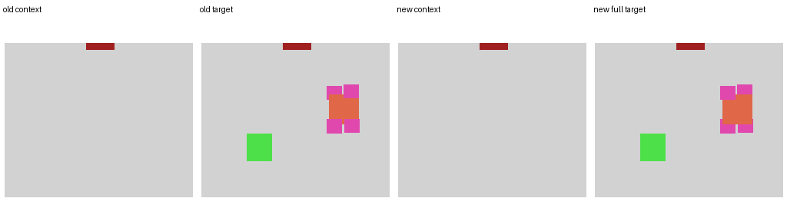
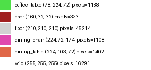

# Qwen Input / Prompt Review After Render Fix

sample_id: `36c96aa6-a318-4212-aecc-22a206d7b217_room_00`

## Old Current Package Files

- old context image: `old_current_metadata_files/old_context_image.png`
- old target image: `old_current_metadata_files/old_target_image.png`
- old metadata row: `old_current_metadata_files/old_metadata_row.json`

## Qwen Actual Input After Fix

- prompt: `03_prompt.txt`
- context_image: `01_context_image_qwen_input.png`

## Qwen Supervision Target After Fix

- image: `02_target_full_semantic_image.png`

## Context Image Semantic Summary

- unique categories: `['door', 'floor', 'void']`
- floor pixels: `48912`
- void pixels: `16291`
- door pixels: `333`
- window pixels: `0`
- wall_in_registry: `False`
- contains furniture: `False`
- context_has_no_door_window: `False`

## Full Semantic Target Summary

- unique categories: `['coffee_table', 'dining_chair', 'dining_table', 'door', 'floor', 'void']`
- target_contains_architecture: `True`
- target_contains_furniture: `True`
- furniture_on_void_pixels: `0`
- furniture_on_protected_architecture_pixels: `0`
- door_window_overwritten_pixels: `0`
- clipped_object_count: `4`
- zero_written_object_count: `0`

## Prompt Summary

- Architecture_Control present: `True`
- Palette_Control present: `True`
- coordinate leakage terms: `[]`
- old route leakage terms: `[]`

## Human Conclusion

`This sample looks OK.`
