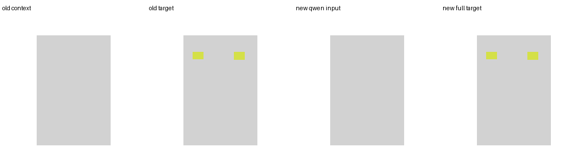
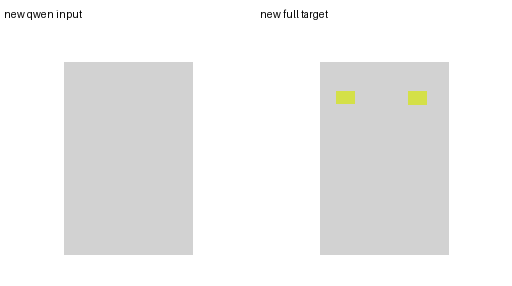
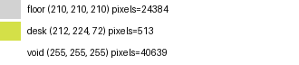
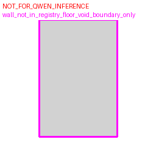

# Qwen Input Render Logic Review

sample_id: `36c96aa6-a318-4212-aecc-22a206d7b217_room_01`

## Files

- `00_old_metadata_row.json`
- `01_old_context_image.png`
- `02_old_target_image.png`
- `10_new_qwen_input.png`
- `11_new_qwen_input_render_debug.json`
- `12_new_metric_transform.json`
- `20_new_target_full_semantic.png`
- `21_new_target_render_debug.json`
- `30_prompt.txt`
- `43_human_arch_debug_NOT_FOR_QWEN.png`

## Checks

- context_palette_exact: `True`
- target_palette_exact: `True`
- context_contains_furniture: `False`
- target_contains_architecture: `True`
- target_contains_furniture: `True`
- context_target_same_shape: `True`
- context_target_same_transform_hash: `True`
- protected_pixels_unchanged: `True`
- furniture_on_void_pixels: `0`
- furniture_on_protected_pixels: `0`
- door_window_overwritten_pixels: `0`
- zero_written_object_count: `0`
- clipped_object_count: `0`
- fallback_object_count: `0`
- architecture_control_prompt: `Architecture_Control. Use the architecture condition image for the room floor region, room boundary, and doors/windows when visible. Keep all furniture inside floor pixels and avoid door/window areas.`
- prompt_leakage_terms: `[]`
- wall_in_registry: `False`
- wall_in_architecture_json: `False`
- wall_source_mesh_available: `False`
- wall_rendering_policy: `no_wall_class_floor_void_boundary_only`
- door_pixels: `0`
- window_pixels: `0`
- looks_ok: `True`
