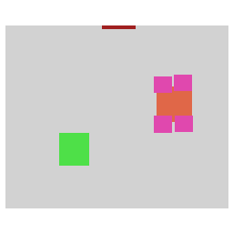
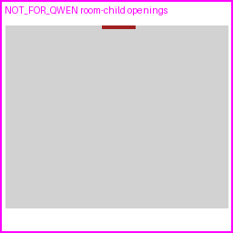

# SemLayoutDiff Room-child Opening Review

sample_id: `36c96aa6-a318-4212-aecc-22a206d7b217_room_00`

## Counts
- scene global door count: `1`
- scene global window count: `0`
- room.children door refs: `1`
- room.children window refs: `0`
- qwen_input door pixels: `148`
- qwen_input window pixels: `0`
- scene global door ignored: `False`
- drop reason: ``

## Policy
Only Door/Window meshes referenced by this room's `children` list count as room openings. Scene-global Door/Window meshes are ignored when not referenced by this room.
