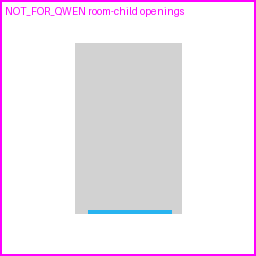

# SemLayoutDiff Room-child Opening Review

sample_id: `faf62fbc-739a-40da-aac3-12b6807ee7e3_room_00`

## Counts
- scene global door count: `10`
- scene global window count: `10`
- room.children door refs: `0`
- room.children window refs: `1`
- qwen_input door pixels: `0`
- qwen_input window pixels: `336`
- scene global door ignored: `True`
- drop reason: `drop_no_room_child_door_anchor`

## Policy
Only Door/Window meshes referenced by this room's `children` list count as room openings. Scene-global Door/Window meshes are ignored when not referenced by this room.
