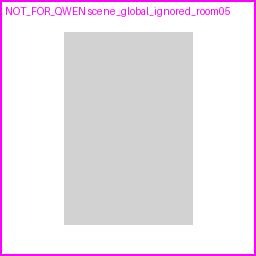

# SemLayoutDiff Room-child Opening Review

sample_id: `36c96aa6-a318-4212-aecc-22a206d7b217_room_05`
label: `scene_global_ignored_room05`

- scene global door count: `1`
- scene global window count: `0`
- room.children door anchors: `0`
- room.children window anchors: `0`
- scene global door ignored when not in room.children: `True`
- qwen_input door pixels: `0`
- qwen_input window pixels: `0`
- drop reason: `drop_no_room_child_door_anchor`

Policy: only Door/Window meshes referenced by this room's `children` list count as openings. Scene-global meshes are ignored if not referenced by this room.
